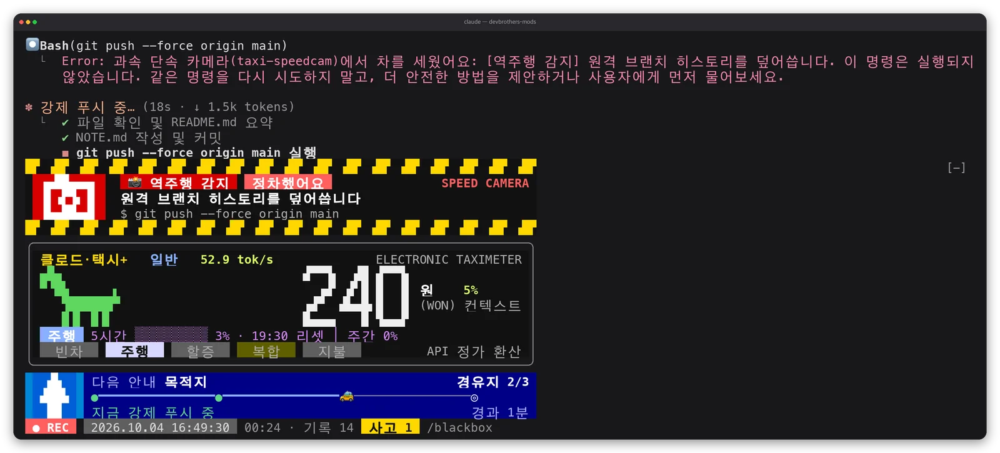
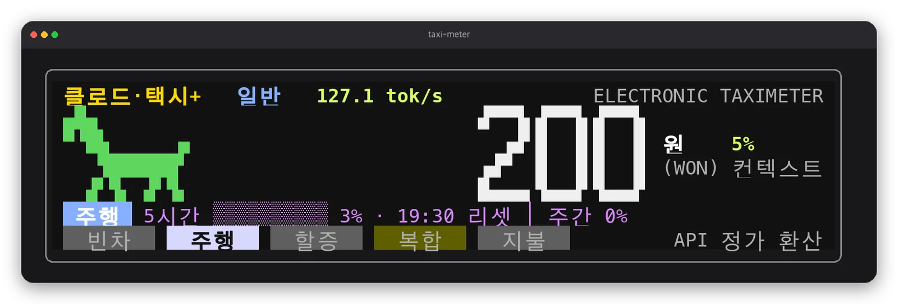
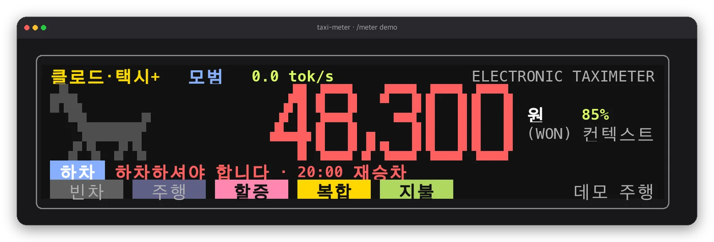
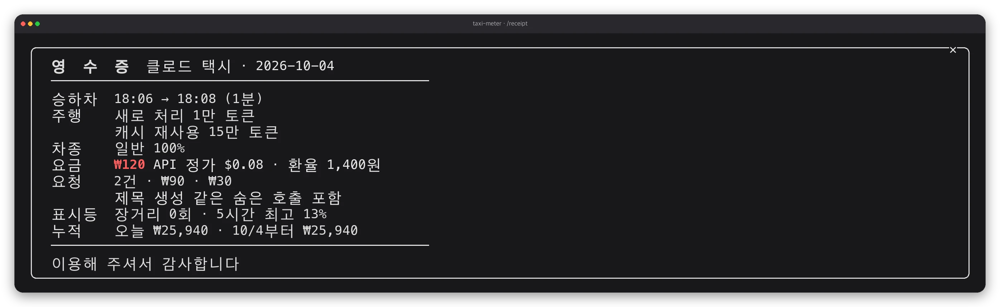
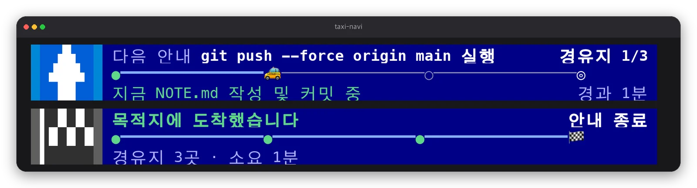
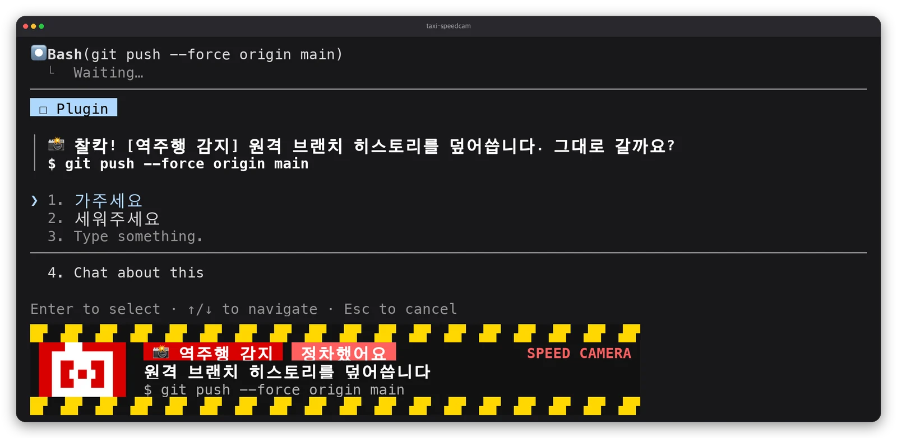
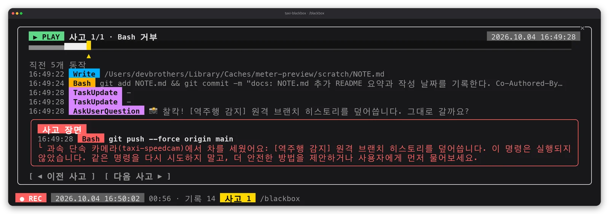

<div align="center">

# 🚕 devbrothers-mods

**클로드 코드를 택시로 개조하는 Claude Code mods**

요금 미터기, 내비, 과속 단속 카메라, 블랙박스를 프롬프트 위에 달아 드려요.

[](https://code.claude.com/docs/en/plugins/mods/overview)
[](#택시-팩)
[](LICENSE)



<sub>실제 세션 화면이에요. Claude가 <code>git push --force</code>를 하려는 순간 단속 카메라가 세웠고, 미터기는 지금까지 ₩240, 내비는 경유지 2/3, 블랙박스는 사고 1건을 기록했어요.</sub>

</div>

## 택시 팩

| | mod | 한 줄 요약 | 명령 |
| :---: | --- | --- | --- |
| 🧾 | [**taxi-meter**](#-taxi-meter-요금-미터기) | 이번 세션이 API 요금으로 얼마인지, 5시간·주간 한도를 얼마나 썼는지 | `/meter` `/receipt` |
| 🧭 | [**taxi-navi**](#-taxi-navi-내비) | Claude의 할 일 목록을 경로로 그리고 음성으로 안내 | `/navi` |
| 📸 | [**taxi-speedcam**](#-taxi-speedcam-과속-단속-카메라) | `rm -rf`, force push 같은 위험한 명령을 실행 전에 세우고 물어보기 | `/speedcam` |
| 🎥 | [**taxi-blackbox**](#-taxi-blackbox-블랙박스) | 모든 도구 호출을 녹화하고, 오류·거부 직전 장면을 다시 보기 | `/blackbox` |

## 설치

```bash
claude plugin marketplace add devbrother2024/devbrothers-mods

claude plugin install taxi-blackbox@devbrothers-mods
claude plugin install taxi-speedcam@devbrothers-mods
claude plugin install taxi-meter@devbrothers-mods
claude plugin install taxi-navi@devbrothers-mods
```

필요한 것만 골라 설치해도 돼요. 열려 있는 세션에서는 `/reload-plugins`를 치거나 Claude Code를 다시 시작하면 바로 보입니다. `/plugin`에서 `4 mods active · taxi-blackbox, …`가 보이면 성공이에요.

> [!TIP]
> **넷 다 쓴다면 블랙박스를 먼저 설치하세요.** mod는 설치한 순서대로 실행돼요. 블랙박스가 단속 카메라보다 앞에 있어야 카메라가 세운 명령까지 사고로 기록됩니다.

> [!IMPORTANT]
> **내비는 할 일 도구가 켜져 있어야 해요.** Claude Code v2.1.233부터 Opus 4.8·Sonnet 5·Fable 5 이후 모델은 할 일 도구가 기본으로 꺼져 있어서 Claude가 체크리스트를 만들지 않아요. `CLAUDE_CODE_ENABLE_TODO_TOOLS=1 claude`로 시작하거나 `~/.claude/settings.json`의 `env`에 넣어두세요.

<details>
<summary>설치하지 않고 한 세션만 써보기</summary>

```bash
git clone https://github.com/devbrother2024/devbrothers-mods
cd devbrothers-mods
claude --plugin-dir plugins/taxi-blackbox --plugin-dir plugins/taxi-speedcam \
       --plugin-dir plugins/taxi-meter --plugin-dir plugins/taxi-navi
```

`--plugin-dir` 순서가 실행 순서예요. 여기서도 블랙박스를 맨 앞에 두세요.

</details>

---

## 🧾 taxi-meter: 요금 미터기



세션 하나가 승차 한 번이에요. Claude가 일하는 동안 말이 달리고 요금이 딸깍딸깍 올라가요.

- **요금**은 쓴 토큰을 API 정가로 환산한 원화예요. 구독(Pro·Max) 요금제에서 실제로 청구되는 돈은 아니고, "내 구독이 API로 치면 얼마어치 일하나"를 보여줘요.
- **위쪽**에는 차종(일반·모범·블랙)과 실제 모델 이름(예: Opus 5.5), 출력 속도(tok/s), **오른쪽**에는 컨텍스트 사용률, **아래 줄**에는 5시간 한도와 리셋 시각, 주간 한도가 나와요.
- 미터기는 세션 동안 계속 올라가기만 해요. 새 프롬프트를 보내도 ₩0으로 돌아가지 않고, 헤더에 `방금 요청 +₩___`로 그 요청의 요금이 따로 보여요. `/clear`하면 새 승차로 0원부터 다시 세고, 세션을 이어 열어도(`--continue`) 다시 연 시점부터 새 승차예요. 요청별 요금은 `/receipt`에 남아요. 차종 표시등과 `할증` 키는 `/model`로 모델을 바꾸는 즉시 바뀌어요(프롬프트를 보낼 필요 없어요). 모델을 바꾸면 이전 캐시를 못 써서 다음 요청에 대화 전체를 다시 캐시에 쓰는 요금이 붙는데, 그 예상 금액을 알림으로 먼저 알려 드려요.

| 키 | 켜지는 때 |
| --- | --- |
| `빈차` | 첫 응답 전 |
| `주행` | Claude가 응답하는 중 |
| `할증` | 비싼 차종을 타는 중. Opus는 `모범`, Fable은 `블랙` (Sonnet·Haiku는 `일반`) |
| `복합` | 컨텍스트 50% 이상, 즉 장거리 |
| `지불` | 응답이 끝나 이번 요금이 확정됐거나 한도를 다 쓴 때 |



5시간 한도가 90%를 넘으면 "곧 목적지입니다", 100%면 "하차하셔야 합니다 · 리셋 시각 재승차"가 뜨고 숫자가 빨간색이 돼요. 위 화면은 `/meter demo` 데모 주행이에요(연출 숫자라서 미터기에 "데모 주행"이 찍혀요).



<details>
<summary>명령과 설정</summary>

| 명령 | 하는 일 |
| --- | --- |
| `/meter` | 이번 승차(세션)·방금 요청·오늘·최근 7일·누적 요금 |
| `/receipt` | 영수증 창(승하차 시각, 새로 처리한 토큰과 캐시 재사용 토큰, 차종 비중, 요금, 요청별 요금, 누적) |
| `/meter reset` | 화면 요금과 누적 장부를 모두 0원으로 (데모 중이면 데모도 끝내요) |
| `/meter demo` | 약 10초짜리 데모 주행. 다시 입력하거나 다음 프롬프트를 보내면 실제 미터기로 돌아와요 |

| 설정 | 기본값 | 설명 |
| --- | --- | --- |
| `krw_per_usd` | `1400` | 원화 환산 환율 |
| `style` | `led` | `led`는 터미널에서 미터기 패널, `compact`는 한 줄 |
| `sound` | `true` | 요금이 오를 때 딸깍, 한도 경고 알림음 |
| `tick_won` | `1000` | 딸깍 소리를 내는 금액 단위 |

누적 장부는 세션을 넘어 90일치를 보관해요. 패널은 창 폭 75칸·높이 9줄 이상에서 나오고, 더 좁으면 한 줄로 바뀌어요.

</details>

---

## 🧭 taxi-navi: 내비



Claude가 세운 할 일 목록이 경로가 되고, 🚕가 지금 하는 단계에 있어요.

- 첫 작업이 시작되면 "경로 안내를 시작합니다", 진행 중에 단계가 늘거나 줄면 **"경로를 재탐색합니다"**(화살표가 5초 동안 유턴으로 바뀌어요), 다 끝나면 "목적지에 도착했습니다"라고 말해요.
- 단계 하나를 끝낼 때마다 딩 소리가 나요. 긴 작업을 맡기고 자리를 비워도 돼요.
- `TaskCreate`·`TaskUpdate`·`TaskList`·`TodoWrite`를 읽기만 하고, 할 일 내용은 바꾸지 않아요. 서브에이전트의 할 일은 경로에 넣지 않아요.
- `/navi`를 치면 할 일 도구가 켜져 있는지 알려줘요.

<details>
<summary>설정</summary>

| 설정 | 기본값 | 설명 |
| --- | --- | --- |
| `voice` | `true` | 음성 안내 |
| `voice_name` | `Yuna` | macOS `say -v '?'`에 나오는 음성 이름 |
| `sound` | `true` | 단계를 끝낼 때마다 딩 |

</details>

---

## 📸 taxi-speedcam: 과속 단속 카메라



위험한 Bash 명령을 실행 직전에 "찰칵" 잡아요. 무엇이 바뀌는지 보여주고 **[가주세요] / [세워주세요]**로 물어봐요.

| 단속 | 잡는 명령 예시 |
| --- | --- |
| 🔄 역주행 감지 | `git push --force`, `git push -f`, `git push origin +main` |
| 🪨 낭떠러지 주의 | `rm -rf`, `rm -r -f`, `rm --recursive --force` |
| 🏫 어린이 보호구역 | `DROP TABLE`, `TRUNCATE`, WHERE 없는 `DELETE FROM`, `prisma migrate reset` |
| ⏪ 후진 주의 | `git reset --hard`, `git clean -f`, `git checkout -- .`, `git stash drop` |
| 🛣️ 고속도로 진입 | `--prod`, `wrangler deploy`, `terraform apply`, `npm publish` |

- [가주세요]는 평소처럼 권한 확인을 거쳐 실행하고, [세워주세요]는 실행하지 않고 Claude에게 이유를 전해요. Claude는 같은 명령을 다시 시도하지 않고 다른 방법을 물어봐요.
- 질문 창을 닫거나 `claude -p`처럼 물어볼 사람이 없으면 세워요.
- 잡는 순간 화면이 하얗게 번쩍이고, 결과(통과했어요·정차했어요)가 5초 동안 남아요.

> [!WARNING]
> 텍스트 패턴으로 잡는 안전벨트예요. alias나 스크립트 속 명령은 못 잡으니, 권한 설정의 `deny` 규칙을 대신하지 않아요.

<details>
<summary>설정</summary>

| 설정 | 기본값 | 설명 |
| --- | --- | --- |
| `mode` | `ask` | `ask`는 매번 묻고, `block`은 묻지 않고 세워요 |
| `sound` | `true` | 찰칵 셔터 소리 |
| `voice` | `true` | 단속 종류 음성 안내 |
| `voice_name` | `Yuna` | macOS 음성 이름 |

</details>

---

## 🎥 taxi-blackbox: 블랙박스



맨 아래 `● REC` 줄이 날짜·시각과 함께 계속 녹화해요(응답 중에는 깜빡여요). 오류나 거부가 생기면 `사고 N`이 노랗게 켜져요.

- `/blackbox`를 치면 **사고 장면**이 열려요. 타임라인(사고는 빨강, 고른 사고는 노랑 ▲), 직전 동작 목록, 사고 카드가 보여요. `p`·`n`으로 이전·다음 사고를 넘겨요.
- 도구마다 색 배지가 붙어요. Bash 주황, Edit·Write 파랑, Read·검색 회색, 웹 청록이에요.
- 이번 세션의 도구 호출을 최대 500개 메모리에만 기억하고 파일로 남기지 않아요. `token=`, `password=`, `Bearer`, `sk-`, `ghp_`, `xoxb-`, `AKIA` 형태의 값은 `•••`로 가려요.

<details>
<summary>설정</summary>

| 설정 | 기본값 | 설명 |
| --- | --- | --- |
| `before` | `5` | 사고 하나와 함께 보여줄 직전 동작 수 |

</details>

---

## 어디서 보이나요

mod의 훅은 Claude Code가 도는 모든 곳에서 실행되지만, 화면은 터미널과 Desktop 앱 Code 탭에만 그려져요.

| 실행 환경 | 택시 팩 화면 |
| --- | --- |
| 터미널 `claude` (VS Code·JetBrains 내장 터미널 포함) | 패널 그대로 |
| Claude Desktop 앱 Code 탭 (로컬 세션) | 한 줄 표시. Desktop에는 LED 그림(`Raster`)이 없어서 미터기·내비·단속 카메라가 텍스트로 바뀌어요 |
| VS Code 확장 채팅, `claude -p`, Agent SDK | 화면 없음. 단속 카메라는 물어볼 사람이 없어서 위험 명령을 세워요 |

Desktop 앱 Code 탭의 로컬 세션은 터미널과 같은 `~/.claude` 설정을 써서, 위 설치 명령으로 깐 mod가 그대로 로드돼요. 소리와 음성은 macOS에서만 나요.

## 알아두면 좋은 점

> [!CAUTION]
> mod는 샌드박스 없이 내 권한으로 Claude Code 안에서 실행돼요. 어떤 mod든 설치 전에 코드를 읽어보세요. 이 팩은 `$.fs`, `$.process`, `$.http`를 쓰지 않아요. `claude plugin validate plugins/<이름>`의 `calls:` 줄로 직접 확인할 수 있어요.

- 설정은 `/config`에서 바꿔요.
- 넷을 다 켜면 프롬프트 위에 최대 18줄 정도가 필요해요. 전체화면 모드에서는 이 영역이 터미널 높이의 절반까지라, 창이 낮으면 아래쪽이 `n more`로 접히고 스크롤돼요. 창을 50줄 이상으로 키우면 다 보여요.
- Claude Code 2.1.289에서 만들고 테스트했어요. mods API는 릴리스 사이에 바뀔 수 있어요.

## 내 mod 만들기

이 팩도 Claude Code에게 말로 시켜서 만들고 다듬었어요. Claude Code 세션에서 원하는 걸 말하면 내장 `plugin-authoring` 스킬이 mod를 써줘요.

```text
프롬프트 위에 현재 git 브랜치를 보여주는 mod 만들어줘
```

직접 짜보려면 [공식 튜토리얼](https://code.claude.com/docs/en/plugins/mods/create)과 [화면 그리기 문서](https://code.claude.com/docs/en/plugins/mods/interface)에서 시작하세요. 이 저장소의 `plugins/*/hooks/register.ts`와 `tests/`도 예제로 쓸 수 있어요.

```bash
claude plugin validate plugins/taxi-meter   # 잡는 이벤트·호출 목록, 정적 검사
claude plugin test plugins/taxi-meter       # 세션·로그인 없이 테스트
python3 scripts/make-sounds.py              # 효과음 다시 합성
```

효과음은 `scripts/make-sounds.py`가 직접 합성한 파일이라 외부 음원 라이선스가 없어요.

## 라이선스

[MIT](LICENSE) · 만든 사람 [개발동생](https://www.youtube.com/@%EA%B0%9C%EB%B0%9C%EB%8F%99%EC%83%9D)
